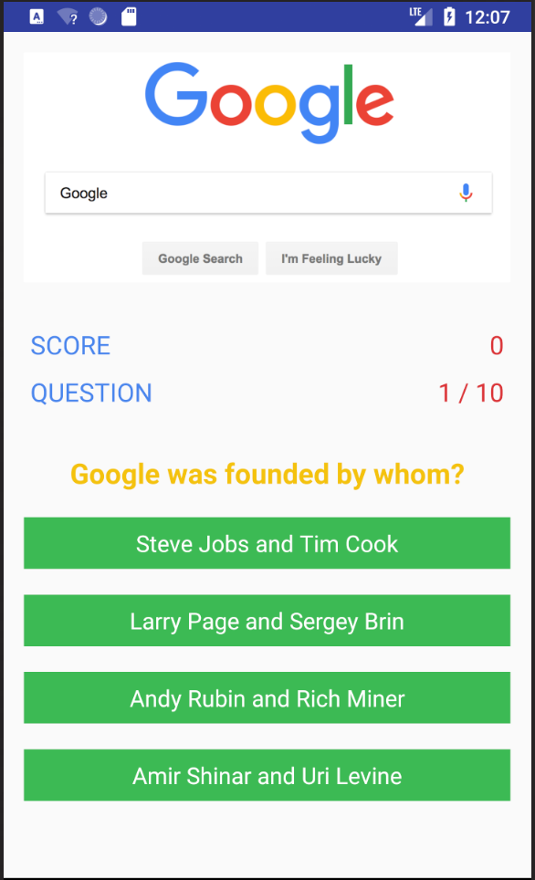
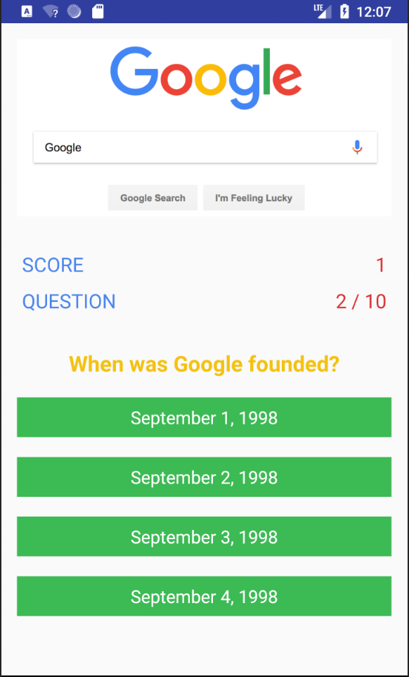
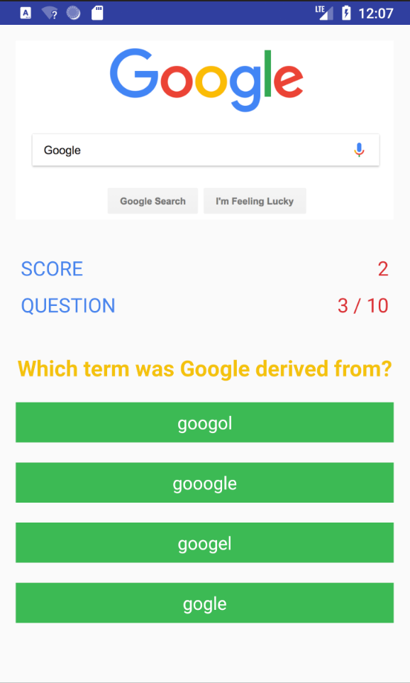
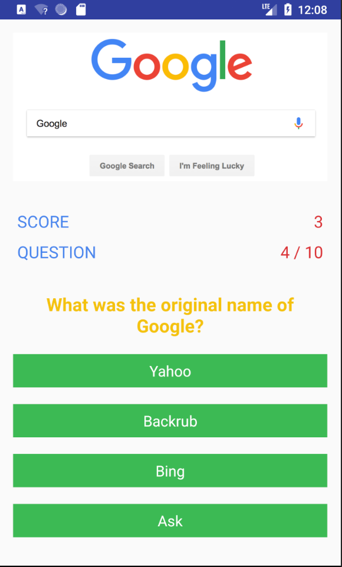
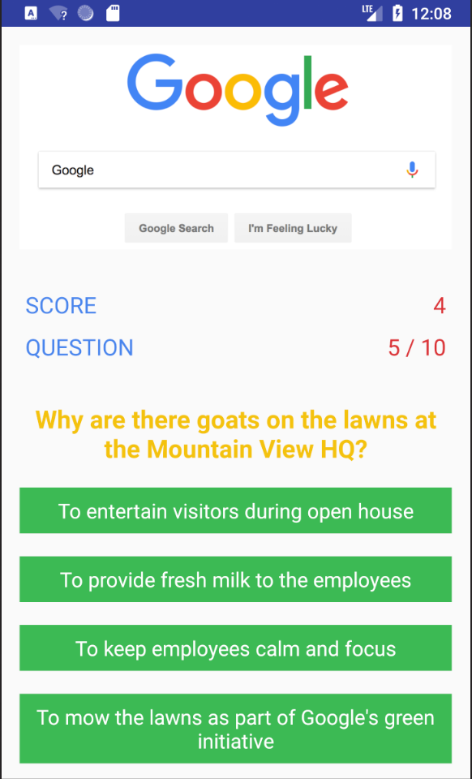
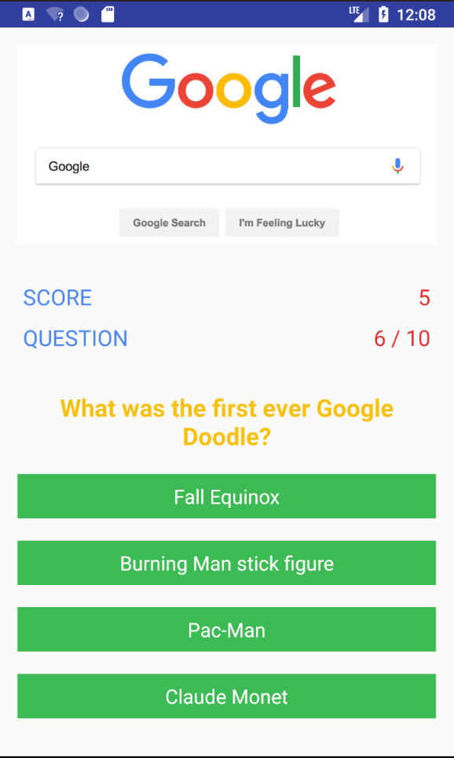
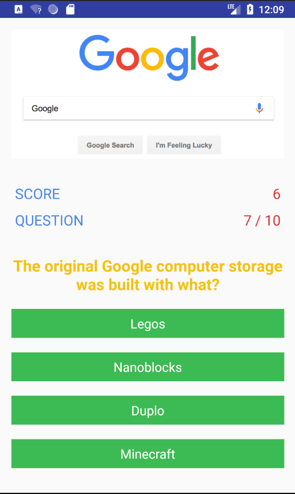
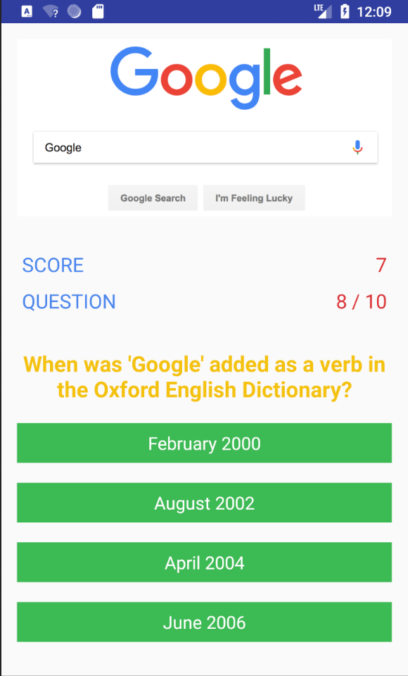
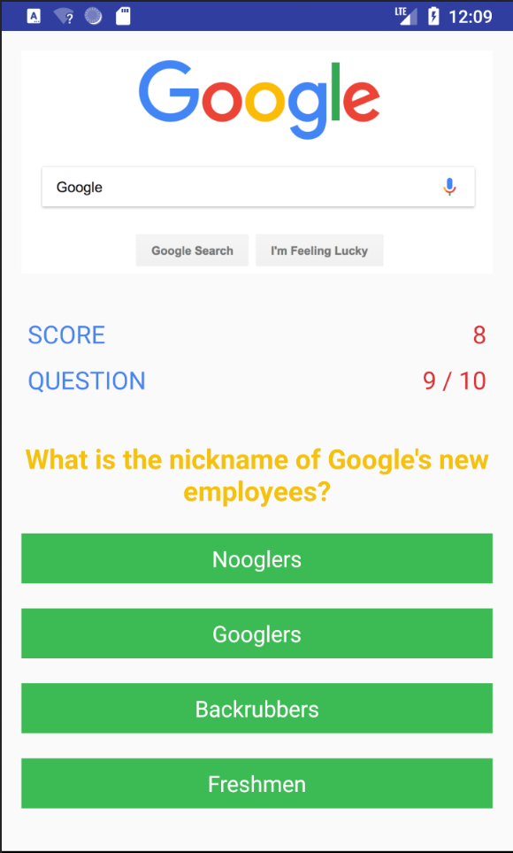
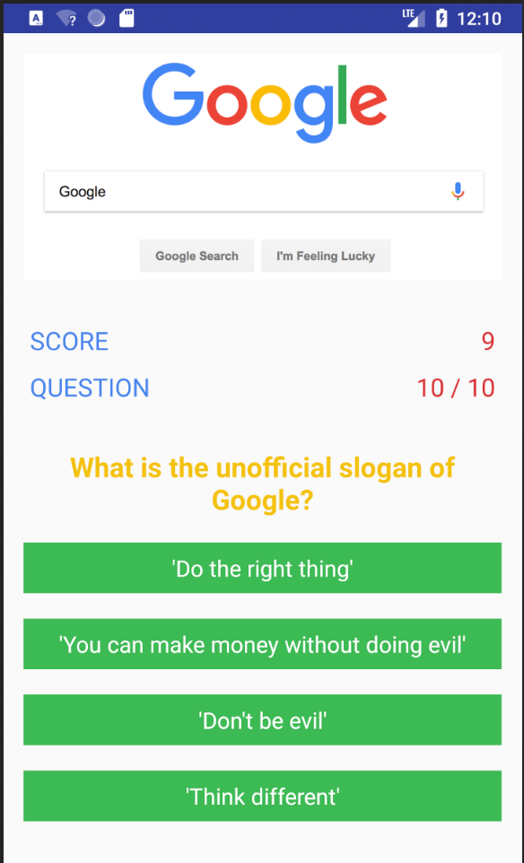

<h1> Quiz App </h1>

<h3> Google 'Google' </h3>

 I built an Android Quiz App for the Udacity Grow with Google Scholarship Challenge. 
I thought it would be fitting to design a quiz about Google as my topic of choice.
I take full ownership over the creative vision, planning, and development of the app. 

### Contributing

I would love for you to help make the skeleton more awesome. There are three ways to contribute:

1. Ask for a bug fix or enhancement!
2. Submit a pull request for a bug fix or enhancement!
3. Code review an open pull request!

Be prepared to give and receive specific, actionable, and kind feedback!
